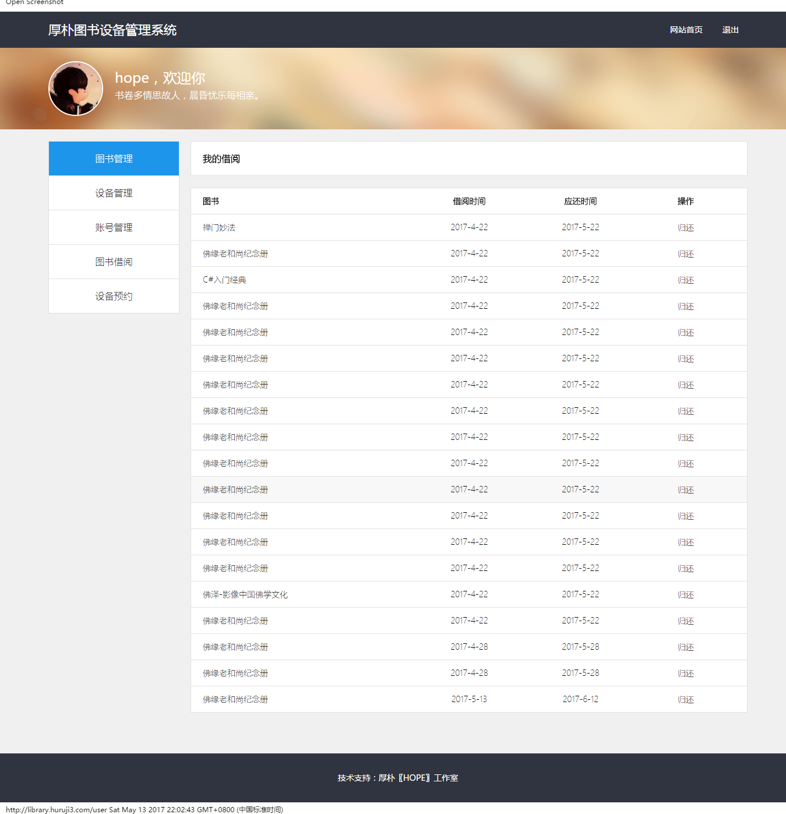
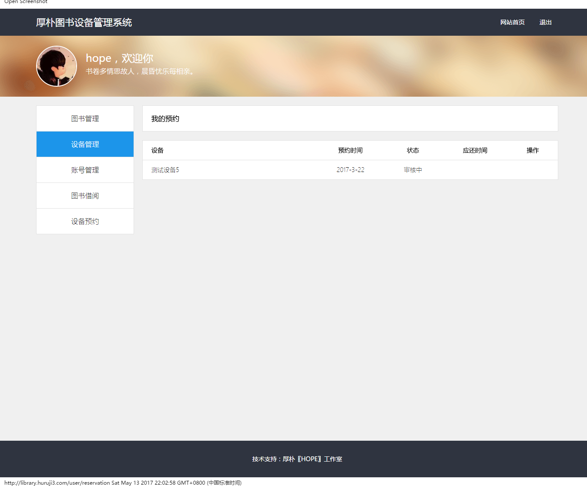
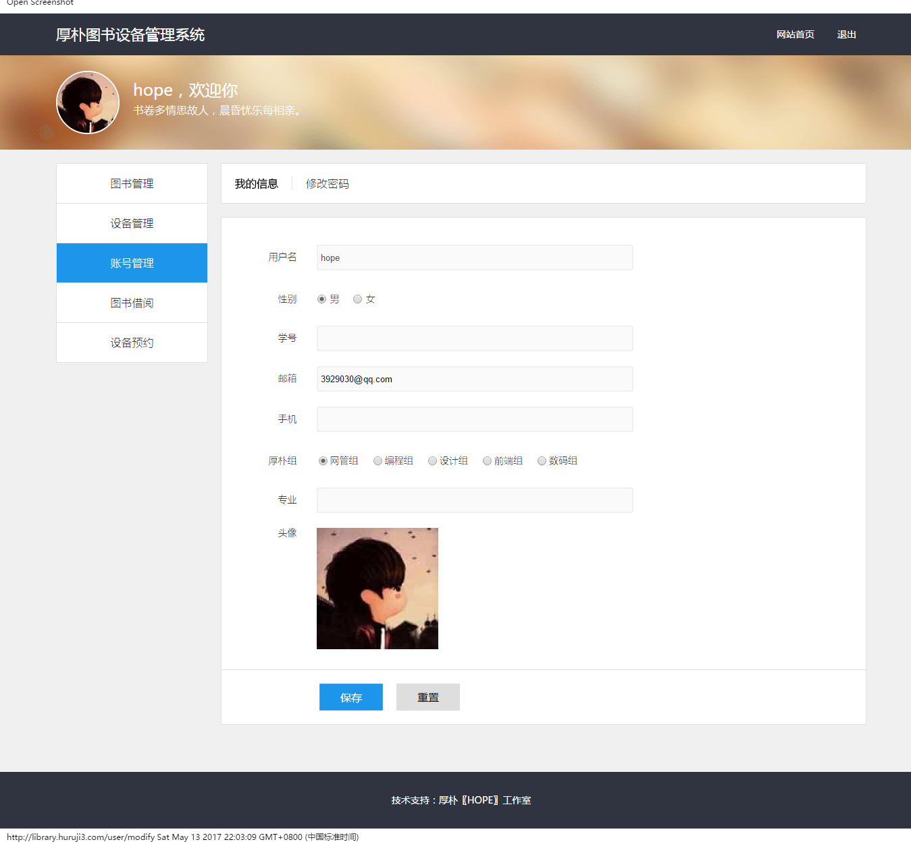
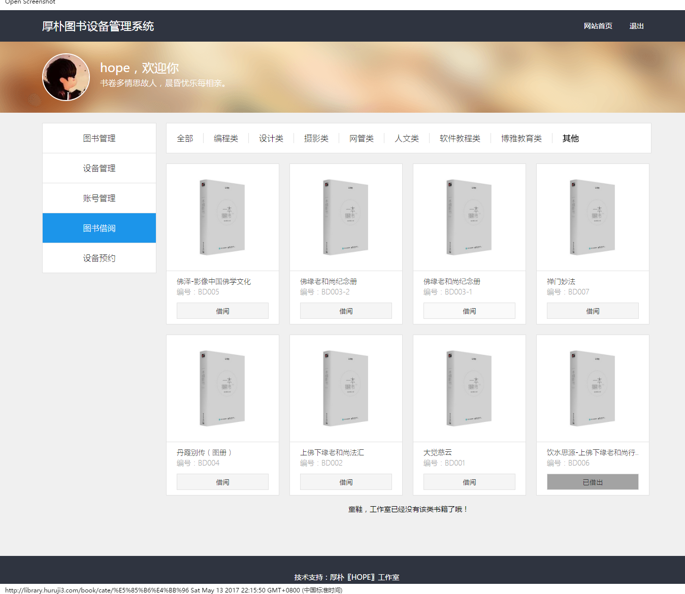
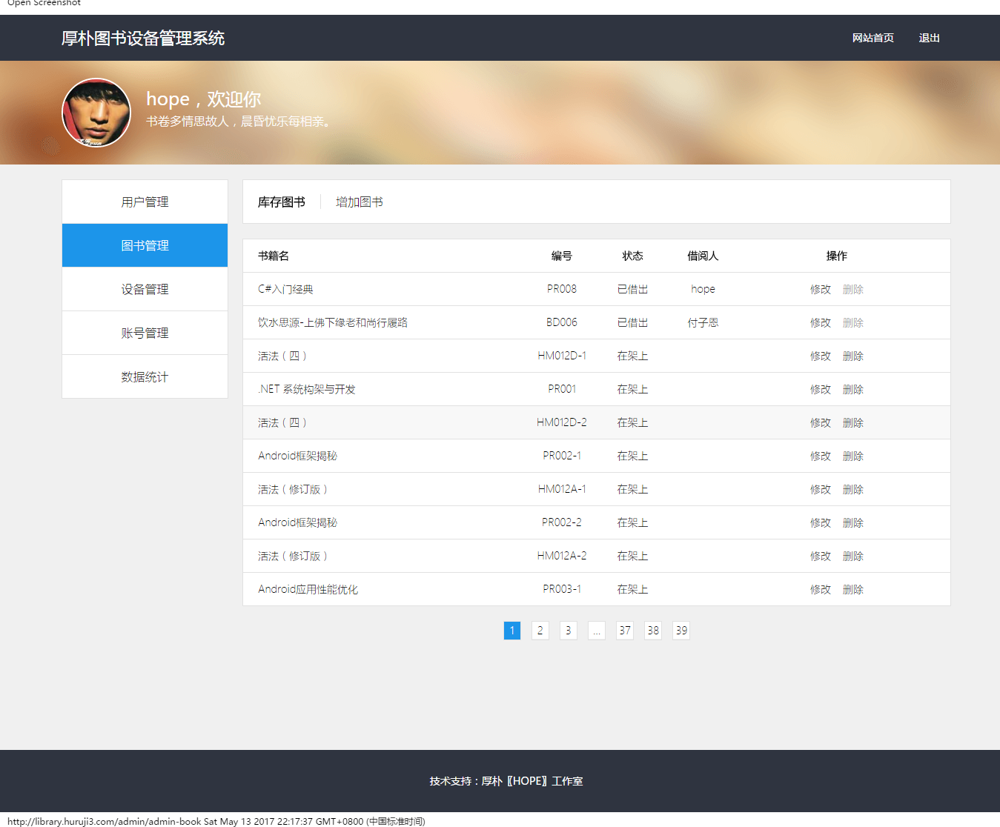

# 厚朴工作室图书设备管理系统

前端页面构建已分离至新的仓库，查看相关文档规范、代码规范、技术栈请到[https://github.com/huruji/HopeLibrarySystemUE](https://github.com/huruji/HopeLibrarySystemUE)

Beta版本0.0.1请浏览[http://98.142.130.76:3000/](http://98.142.130.76:3000/)

## Installation
1. git clone <code>https://github.com/huruji/HopeLibrarySystem</code>
2. use file <code>hope_v2.sql</code> to create your database in your mysql
3. modify file <code>config.js</code> base on your needs
4. start up app <code>node app</code>
5. view <code>localhost:3000</code> in your browser

## Usage
1. user can borrow books and appointment equipments(用户可以借阅书籍和预约设备)
2. user can receive email before he/she return books(用户会收到邮件提醒归还书籍)
3. user can send email to administrator when he/she appointment equipments(用户可以在预约设备时发送邮件)
4. administrators of book can add books, modify books(图书管理员可以增加、修改图书)
5. administrator of equip can check reservations, he/she can agree or disagree the reservations(设备管理员可以审核预约，他可以通过或者不通过审核)
6. administrator of equip can add equipments, modify equipments(设备管理员可以增加、修改设备)
7. super administrator can add user/administrator, delete user/administrator, modify user/administrator and have all the rights of book adminnistrator/equip adminnistrator(超级管理员可以增加、删除、修改管理员和用户，并拥有图书管理员、设备管理员的所有权限)
8. user/administrator can customize his/her messages like avatar, password(用户和管理员都可以自定义自己的信息，比如：头像、密码)

## Usage images
1. user

2. administrator of book

3. administrator of equipment

3. super administrator

4. public

